# SGPR — Order & Reporting Management System


> Java/Spring Boot backend for creating and managing orders, validating customers against an external service, persisting to SQL Server, securing endpoints with OAuth2/JWT, and emailing error reports.
---

## 1. Overview

SGPR is a backend API that:

* Creates, lists, and queries customer orders with clear business rules.
* Validates customers via an external validation endpoint (WireMock in dev).
* Persists data using Spring Data JPA + Hibernate on Microsoft SQL Server.
* Secures APIs with OAuth2 Resource Server (JWT).
* Records failures in a dedicated ErrorLog table and e-mails notifications on warnings/errors.
* Exposes read-only endpoints for Order Status History and Error Logs.
* Uses a clean structure with Domain + Value Objects, DTOs, and Assemblers.

---

## 2. Tech Stack

* Java 8+ (source compatible)
* Spring Boot 2.7.x (Web, Data JPA, Security, Mail)
* Hibernate / JPA
* Microsoft SQL Server
* OAuth2 / JWT (Auth0 as issuer)
* WireMock (external validation in dev)
* Mailpit (email capture in dev) / Gmail SMTP (prod)
* Maven
* Docker (dev dependencies)

---

## 3. Prerequisites

* Java 8
* Maven 3.6
* Docker Desktop (for SQL Server / WireMock / Mailpit)
* IntelliJ IDEA

---

## 4. Project Setup

# 4.1. Clone the repository

```bash
git clone https://github.com/gasparduartefigueiras/SistemaDeGestaoDePedidosERelatorios.git
```

# 4.2. Import into IntelliJ IDEA

1. “File → Open…"
2. Wait for dependencies to download.

---

# 4.3. Run SQL Server (Docker)

```bash
docker rm -f sgpr-sql 2>/dev/null || true

docker run -d --name sgpr-sql \
  --platform linux/amd64 \
  -e ACCEPT_EULA=Y \
  -e MSSQL_SA_PASSWORD='YourStrong!Passw0rd' \
  -p 1433:1433 \
  mcr.microsoft.com/mssql/server:2022-latest
```

# 4.4. Run WireMock (Validation Service)

```bash
docker exec -it sgpr-sql /opt/mssql-tools18/bin/sqlcmd \
  -S localhost,1433 -U sa -P 'YourStrong!Passw0rd' -C \
  -Q "IF DB_ID('SGPR') IS NULL CREATE DATABASE SGPR; ALTER AUTHORIZATION ON DATABASE::SGPR TO sa;"
```

# 4.5. Run Mailpit (Dev Email)

```bash
docker rm -f sgpr-mailpit 2>/dev/null || true
docker run -d --name sgpr-mailpit \
  -p 1025:1025 -p 8025:8025 \
  axllent/mailpit:latest
```

# 4.6. Start the Application (MSSQL profile)
```bash
mvn spring-boot:run -Dspring-boot.run.profiles=mssql
```

## 5. Configuration (profile mssql)

```yml
spring:
  datasource:
    driver-class-name: com.microsoft.sqlserver.jdbc.SQLServerDriver
    url: jdbc:sqlserver://localhost:1433;databaseName=SGPR;encrypt=true;trustServerCertificate=true
    username: sa
    password: YourStrong!Passw0rd

  jpa:
    open-in-view: false
    hibernate:
      ddl-auto: update
    properties:
      hibernate.dialect: org.hibernate.dialect.SQLServerDialect
      hibernate.jdbc.time_zone: UTC
    show-sql: true

  security:
    oauth2:
      resourceserver:
        jwt:
          issuer-uri: https://dev-24h0nd8g3ss0j3oq.us.auth0.com/

  mail:
    host: localhost
    port: 1025
    properties:
      mail.smtp.auth: false
      mail.smtp.starttls.enable: false

validation:
  listUrl: http://localhost:8089/validate
  clientId: my-client-id
  clientSecret: my-client-secret

email:
  from: no-reply@sgpr.local
  to: gaspar.duarte.figueiras@gmail.com
  enabled: true
  notify-on-pending: true
```

## 6. Database

Hibernate (ddl-auto: update) will create/update tables.
If you prefer a seed script, here’s a schema aligned with the domain:

```sql
CREATE TABLE Client (
                        Id        UNIQUEIDENTIFIER NOT NULL PRIMARY KEY,
                        Name      NVARCHAR(150)    NOT NULL,
                        Email     NVARCHAR(254)    NOT NULL UNIQUE,
                        CreatedAt DATETIME2        NOT NULL
);

CREATE TABLE Orders (
                        Id                UNIQUEIDENTIFIER NOT NULL PRIMARY KEY,
                        CustomerName      NVARCHAR(150)    NOT NULL,
                        CustomerEmail     NVARCHAR(254)    NOT NULL,
                        OrderValue        DECIMAL(12,2)    NOT NULL,
                        CreationDate      DATETIME2        NOT NULL,
                        Status            NVARCHAR(20)     NOT NULL, -- PENDING|APPROVED|REJECTED
                        ValidationMessage NVARCHAR(500)    NULL,
                        CONSTRAINT FK_Order_ClientEmail FOREIGN KEY (CustomerEmail) REFERENCES Client(Email)
);

CREATE TABLE OrderStatusHistory (
                                    Id            UNIQUEIDENTIFIER NOT NULL PRIMARY KEY,
                                    OrderId       UNIQUEIDENTIFIER NOT NULL,
                                    InitialStatus NVARCHAR(20)     NOT NULL,
                                    FinalStatus   NVARCHAR(20)     NOT NULL,
                                    Reason        NVARCHAR(500)    NULL,
                                    ChangedBy     NVARCHAR(100)    NOT NULL,
                                    ChangedAt     DATETIME2        NOT NULL,
                                    CONSTRAINT FK_History_Order FOREIGN KEY (OrderId) REFERENCES Orders(Id)
);

CREATE TABLE ErrorLog (
                          Id       UNIQUEIDENTIFIER NOT NULL PRIMARY KEY,
                          Level    NVARCHAR(10)     NOT NULL, -- ERROR|WARN|INFO
                          Message  NVARCHAR(2000)   NOT NULL,
                          LoggedAt DATETIME2        NOT NULL,
                          OrderId  UNIQUEIDENTIFIER NULL,
                          CONSTRAINT FK_Error_Order FOREIGN KEY (OrderId) REFERENCES Orders(Id)
);

CREATE INDEX IX_Orders_Status_Created   ON Orders(Status, CreationDate DESC);
CREATE INDEX IX_OSH_Order_ChangedAt     ON OrderStatusHistory(OrderId, ChangedAt DESC);
CREATE INDEX IX_ErrorLog_LoggedAt       ON ErrorLog(LoggedAt DESC);

ALTER TABLE Orders ADD CONSTRAINT CK_Orders_Status
    CHECK (Status IN ('PENDING','APPROVED','REJECTED'));
ALTER TABLE OrderStatusHistory ADD CONSTRAINT CK_OSH_Status
    CHECK (InitialStatus IN ('PENDING','APPROVED','REJECTED')
        AND FinalStatus   IN ('PENDING','APPROVED','REJECTED'));
ALTER TABLE ErrorLog ADD CONSTRAINT CK_ErrorLog_Level
    CHECK (Level IN ('ERROR','WARN','INFO'));
```

## 7. Security (JWT)

This API is protected with OAuth2 Resource Server.
All requests must include a valid JWT issued by Auth0.

1. Make a POST request to Auth0:

* POST  https://dev-24h0nd8g3ss0j3oq.us.auth0.com/oauth/token

Body
```json
{
  "client_id": "un7noU7ULIgci3AGYzGiAMbIyvLeaGf7",
  "client_secret": "4hWuHdcDf2gpzP7WKtEwyAwLhP-o4w-Gpf6QA08nnqndBqLM5MWmgxeFnBXHeSvl",
  "audience": "https://sgpr-api",
  "grant_type": "client_credentials"
}
```
2. Copy the access_token from the response.

3. In every request to the API, add in Authorization:
Bearer Token

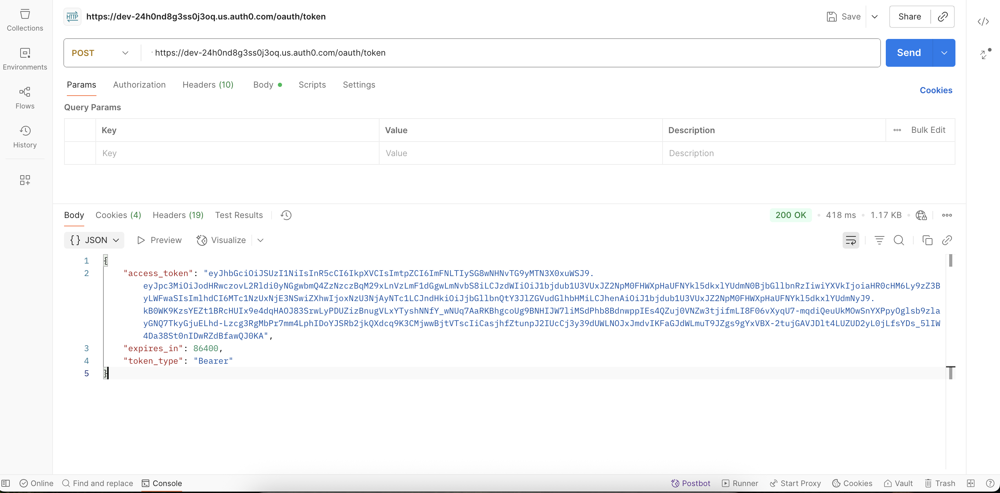

## 8. API Endpoints

All endpoints require a valid JWT (see Security).

# 8.1. Orders

* POST /api/orders — create order

Approved:

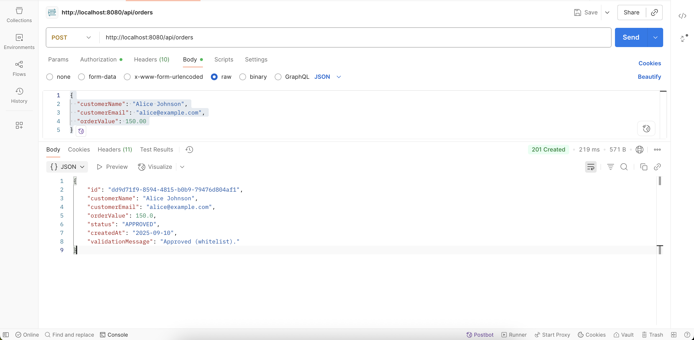
Test payload ideas (match @example.com):

Rejected:


Test payload ideas (email contains reject):

Pending (timeout / slow validation):

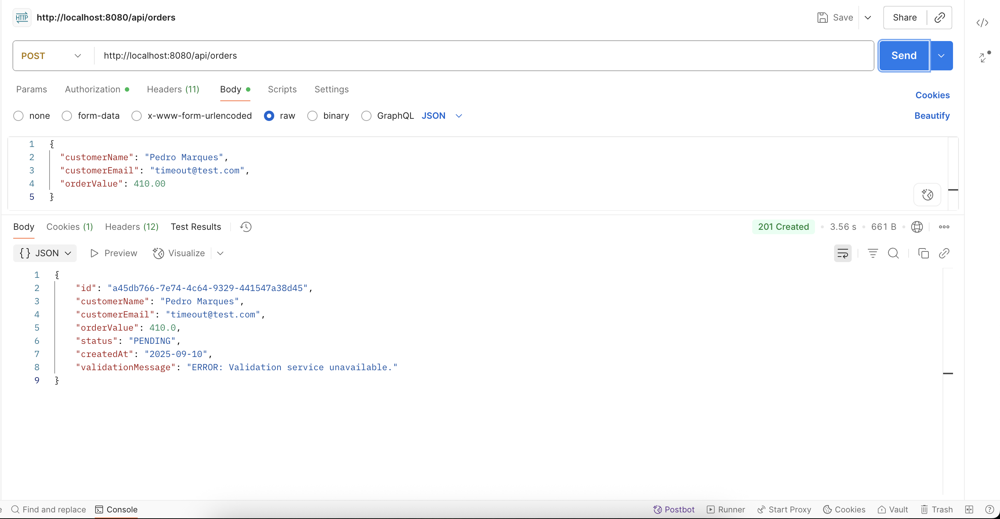
Test payload ideas (delay mapping): timeout@test.com


* GET /api/orders — list all

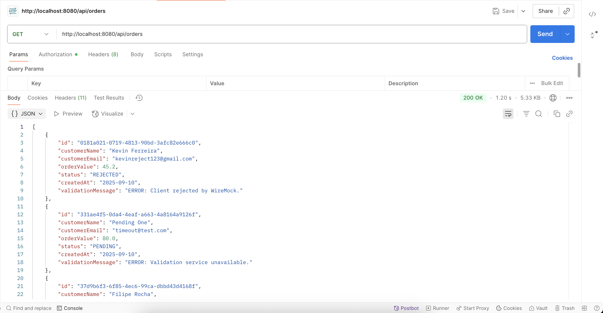

* GET /api/orders/{id} — get by ID

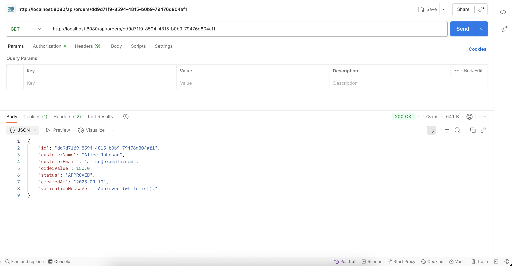


* GET /api/orders/status/{status} - get by status

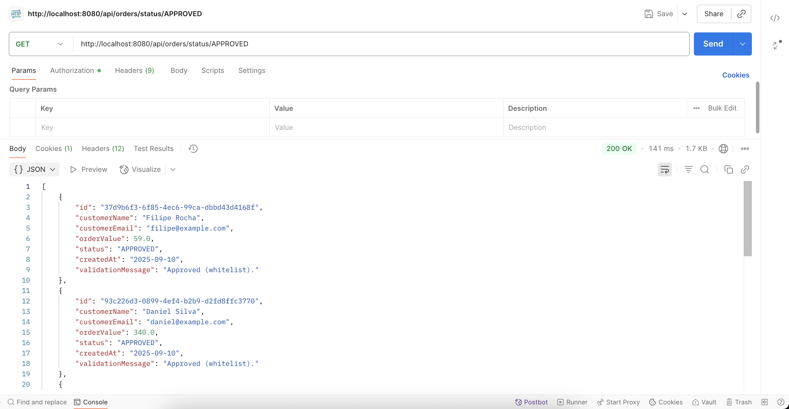
(APPROVED)

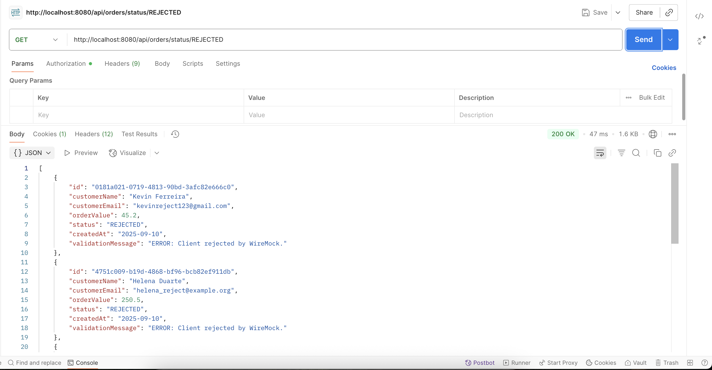
(REJECTED)

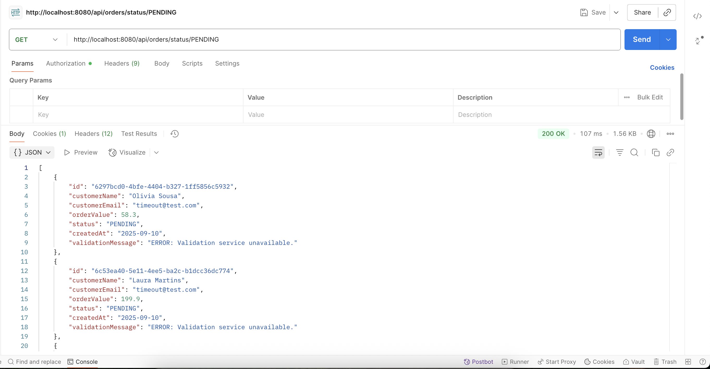
(PENDING)

* GET /api/orders/date/{from}/{to} - get by defined period of time

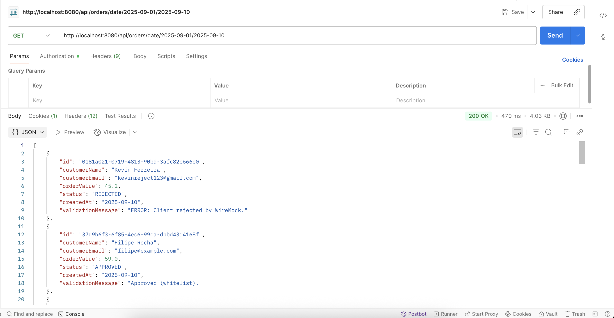


# 8.2. Order Status History

* GET /api/order-status-history — list all histories

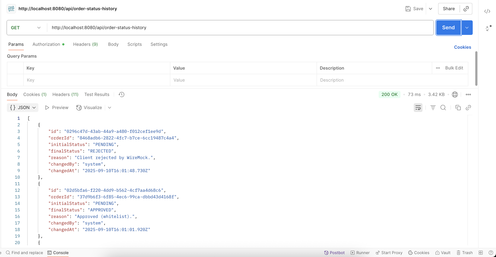

* GET /api/order-status-history/{historyId} — get a history by its UUID

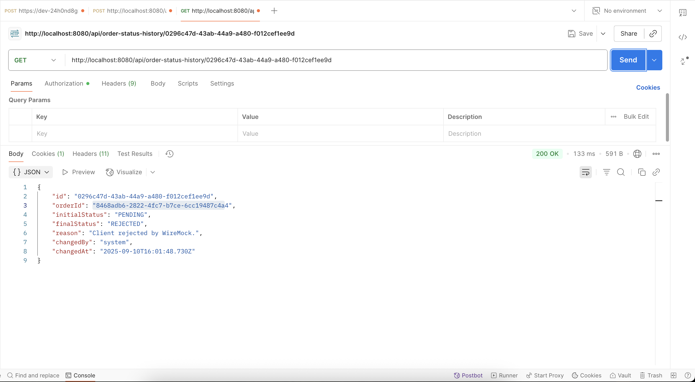

* GET /api/order-status-history/by-order/{orderId} — get a history for an order id

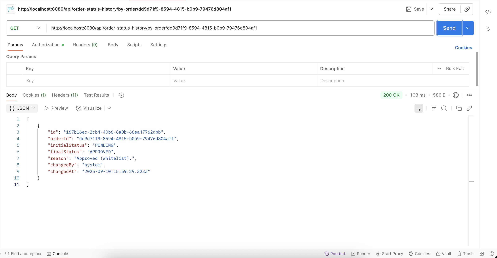


# 8.3. Error Logs

* GET /api/error-logs — list all logs

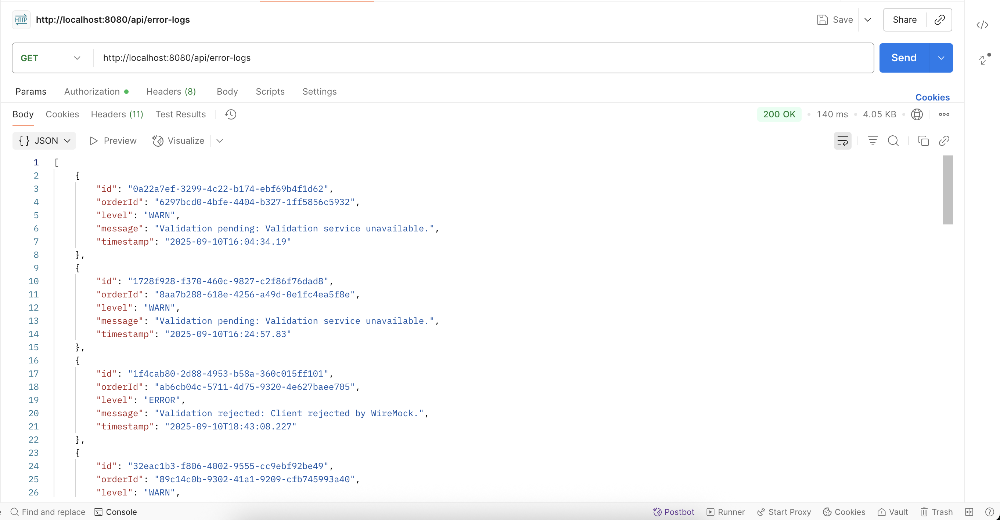


* GET /api/error-logs/order/{orderId} — logs for a given order id

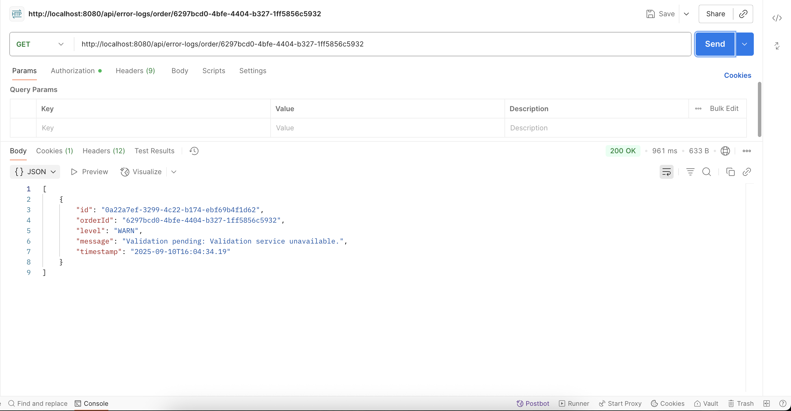


* GET /api/error-logs/level/{level} — logs filtered by level (ERROR/WARN/INFO)

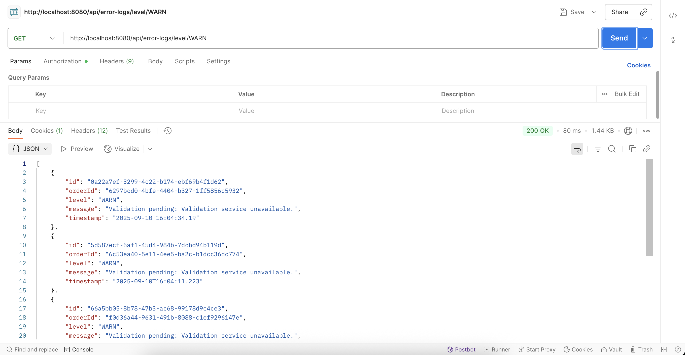
(WARN)

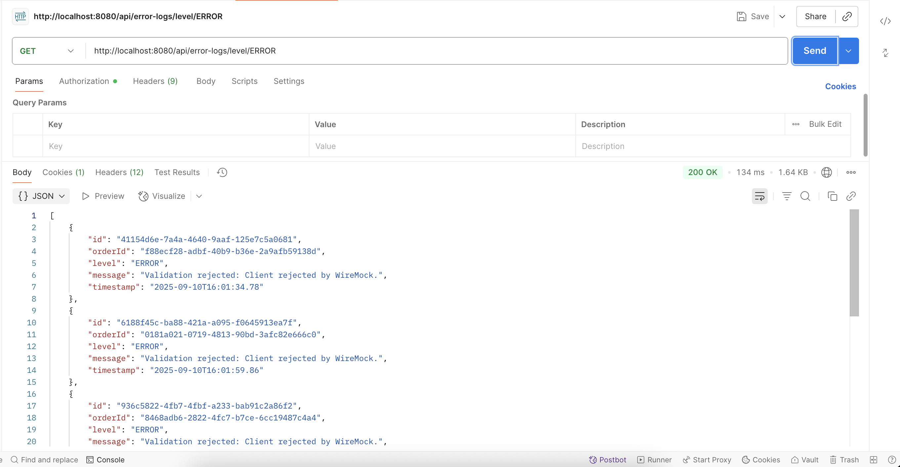
(ERROR)


## 9. Email Notifications & Error Reporting

Whenever an ERROR or WARN log is created in the system, two things happen automatically:
1.	The log is stored in the ErrorLog table.
2.	An email notification is sent to the configured recipient.

In development, emails are captured by Mailpit, accessible at: http://localhost:8025

Below is an example of how error notifications appear in Mailpit:

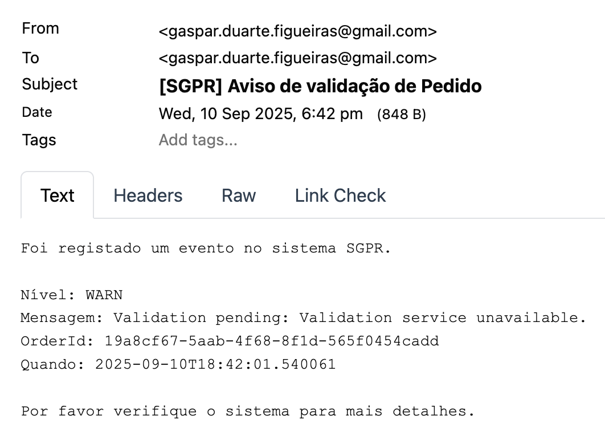
(WARN)

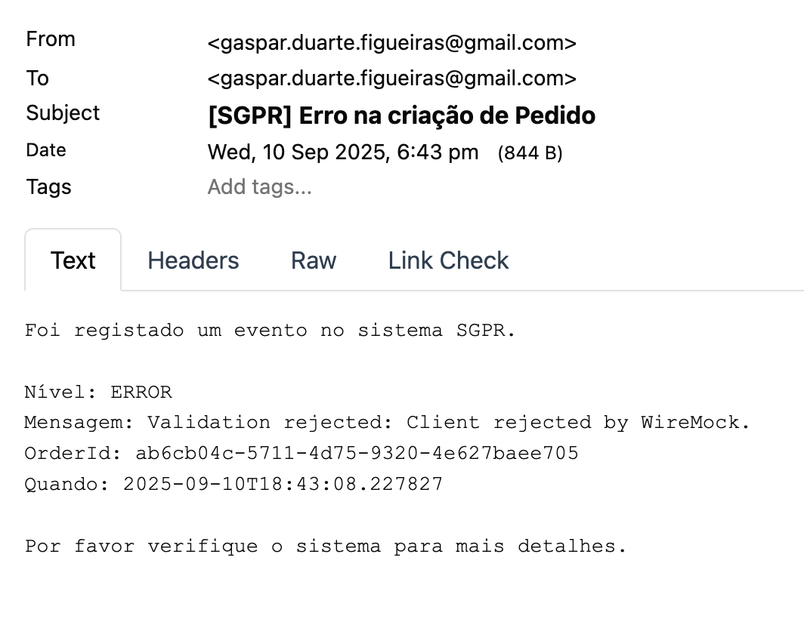
(ERROR)


## 10. Tests & Quality


